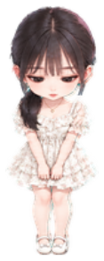

<div align="center">



# 小小的她 · xiaoxiaodeta

**A quiet, offline desktop companion for Windows — 她就住在你的桌面上。**

`Windows` `Electron` `React` `离线运行` `自定义形象`

</div>

---

「小小的她」是一个安静、离线、可拖动的 Windows 桌面宠物：透明置顶、不弹广告、不上传任何数据。她有待机、奔跑、挥手、比心、猜拳等 20 组动作，有喂养、签到、成长等级、衣橱换装、记忆翻牌等本地玩法，还有会根据你说话内容做简短回应的本地文字聊天（关键词规则，不是联网 AI）。

默认形象是一位 AI 绘制的 Q 版女孩；你也可以用自己的动作图集替换她——让桌宠变成你想要的样子。

## ✨ 功能

- **桌面陪伴**：透明置顶小窗，可拖动、可点击穿透，不占任务栏
- **互动回应**：点头摸摸、投喂点心、比心、抱抱、猜拳（真的会在桌面亮出石头剪刀布）
- **本地成长**：签到 / 任务 / 经验等级 / 徽章 / 星星商城衣橱（8 套配色主题），全部保存在本机
- **小游戏**：记忆翻牌、星星狩猎、抓星星，完成有奖励
- **文字聊天**：本地关键词回应，不联网、无语音、无远程 AI
- **更换形象**：上传照片一键变桌宠，或导入完整动作图集（详见下文）

## 🖼️ 更换形象（自定义你的桌宠）

打开托盘菜单或陪伴面板 →「徽章装扮」→「我的形象」，两种方式：

**方式一：照片一键变桌宠（推荐，完全离线）**

1. 点「选择照片」上传一张或多张照片（第一张选「日常站姿」，其余可选挥手、开心、失落等姿势）
2. 点「生成我的桌宠」——程序用内置的本地 AI 模型（u2netp，仅 4 MB）自动抠图，全程在你的电脑上完成
3. 桌宠立刻换上新形象：会呼吸、会朝你跑、摸摸头会开心弹跳、被拖动会晃

照片形象用变换动画表达动作，轻量可爱；想要完整的手工级动作（挥手、跳跃、猜拳手势、眼神跟随），用方式二。

**方式二：AI 一键生成 Q 版形象（照片 → Q 版 → 全套动作）**

上传一张照片，应用会自动完成当初制作默认角色的全流程：AI 先把照片转成 Q 版角色，再逐个生成待机、挥手、跳跃、失落、等待、奔跑、查看等动作条带，本地抠图、按统一脚底基线拼装成完整 8×11 图集，通过质量校验后自动安装——效果与默认角色完全一致。

- 需要在「生成设置」里填入**你自己的** OpenAI 兼容图像生成 API（服务地址 / 模型 / Key，如 `https://api.wenle.ai/v1` + `gpt-image-2.5`）；一次导入约 8 次生成请求，由该服务计费
- 照片只发送给你配置的生成服务（需勾选同意），抠图、拼装、QA、安装全部在本机完成，照片和中间产物不会进入源码仓库

**方式三：导入完整 8×11 动作图集（高级）**

从社区获取或自制符合 [docs/ATLAS-FORMAT.md](docs/ATLAS-FORMAT.md) 规范的图集 PNG，直接拖进「我的形象」卡片或从文件选择器导入。仓库 `scripts/` 附带图集质检与安装脚本（`qa-action-atlas.py`、`normalize-atlas.py`、`install-custom-atlas.ps1`）。

🔒 三种方式的数据都只保存在你电脑的应用数据目录里，**不会被上传到项目方，也不会进入源码仓库**。「恢复默认形象」随时一键还原。

## 📦 快速开始

开发运行（需要 Node.js 18+）：

```bash
npm ci
npm run dev:desktop
```

打包便携版（`artifacts/desktop-<版本>/win-unpacked/`，附自动打包的 zip）：

```bash
npm run build:desktop
```

打包 NSIS 安装包：

```bash
npm run build:installer
```

## 🧪 测试

```bash
npm test                # 纯逻辑单元测试（存档、动作、小游戏、拖拽、图集安装…）
npm run test:atlas      # 校验默认动作图集完整性（需要 Python 3 + pip install -r requirements-assets.txt）
npm run test:wardrobe   # 校验衣橱素材
```

## 🔒 隐私承诺

- 所有互动、成长、聊天回应都在本地完成，**没有任何遥测和联网上报**
- 你的照片与自定义形象永不进入源码仓库或发布包
- 拖入的图片只在导入校验时被本机程序读取
- 存档是本机的 JSON 文件，卸载也不会删除（NSIS 配置 `deleteAppDataOnUninstall: false`）

## 🗺️ Roadmap

- [x] 应用内导入完整动作图集（拖拽 / 文件选择）
- [x] **照片一键变桌宠**：本地 AI 抠图（u2netp）+ 变换动画，完全离线免费
- [x] **照片 → Q 版 → 全套动作一键生成**：接入用户自己的图像生成 API，自动完成角色化、逐动作生成、拼装与 QA
- [ ] 照片形象增强：多姿势映射更多动作、眨眼等细节动画
- [ ] 社区形象库：收录大家制作/分享的完整图集
- [ ] 跨平台（macOS / Linux）

## 📄 许可

代码以 [MIT](LICENSE) 协议开源。默认角色素材为 AI 生成，其来源与使用说明见 [ASSETS.md](ASSETS.md)。
